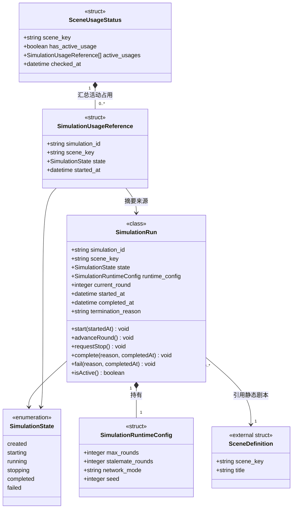

# 仿真编排与容器运行时设计

## 1. 设计目标

编排层负责把静态剧本转换为一次可审计的多 Agent 仿真运行。逻辑 Agent 与容器槽位分离：逻辑身份来自剧本，容器只是可复用的后端执行资源。

核心边界：

- `SceneDefinition` 描述静态剧本内容；
- `SimulationRun` 描述一次仿真实例；
- `SimulationRuntimeConfig` 描述该仿真实例的运行参数；
- `SimulationUsageReference` 和 `SceneUsageStatus` 描述剧本的运行占用情况；
- 剧本加载、查询和预览不得修改仿真运行配置或运行状态；
- 仿真运行数据模型只在本领域定义，不放入剧本管理数据模型。

## 2. 仿真领域模型

### 2.1 仿真运行类 `SimulationRun`

| 字段 | 类型 | 必填 | 描述 |
|---|---|---:|---|
| `simulation_id` | string | 是 | 仿真实例唯一标识。 |
| `scene_key` | string | 是 | 本次仿真引用的剧本标识。 |
| `state` | `SimulationState` | 是 | 仿真实例状态。 |
| `runtime_config` | `SimulationRuntimeConfig` | 是 | 本次仿真的运行参数。 |
| `current_round` | integer | 是 | 当前轮次。 |
| `started_at` | datetime | 否 | 启动时间。 |
| `completed_at` | datetime | 否 | 完成时间。 |
| `termination_reason` | string | 否 | 终止原因。 |

领域函数：

| 函数 | 返回类型 | 职责 |
|---|---|---|
| `start(startedAt)` | void | 进入 `running` 状态并记录开始时间。 |
| `advanceRound()` | void | 当前轮次加一。 |
| `requestStop()` | void | 进入 `stopping` 状态。 |
| `complete(reason, completedAt)` | void | 进入 `completed` 状态并记录原因。 |
| `fail(reason, completedAt)` | void | 进入 `failed` 状态并记录原因。 |
| `isActive()` | boolean | 判断是否仍占用剧本和运行资源。 |

### 2.2 仿真运行配置结构体 `SimulationRuntimeConfig`

| 字段 | 类型 | 必填 | 描述 |
|---|---|---:|---|
| `max_rounds` | integer | 是 | 本次仿真的最大轮数。 |
| `stalemate_rounds` | integer | 是 | 连续无进展终止阈值。 |
| `network_mode` | string | 是 | 网络通信与仿真模式，当前为 `direct`。 |
| `seed` | integer | 是 | 本次仿真的随机种子。 |

所有字段由仿真创建或启动请求确定，并在启动前完成校验。它们不属于 `SceneDefinition`，也不由剧本预览接口返回。

### 2.3 仿真运行引用结构体 `SimulationUsageReference`

表示一个仍占用剧本资源的仿真实例摘要，仅供仿真管理模块内部管理和占用查询接口构造结果。

| 字段 | 类型 | 必填 | 描述 |
|---|---|---:|---|
| `simulation_id` | string | 是 | 仿真实例唯一标识。 |
| `scene_key` | string | 是 | 仿真引用的剧本标识。 |
| `state` | `SimulationState` | 是 | 当前仿真状态。 |
| `started_at` | datetime | 否 | 仿真开始时间。 |

只有 `starting`、`running`、`stopping` 状态的仿真形成活动占用。

### 2.4 剧本占用状态结构体 `SceneUsageStatus`

| 字段 | 类型 | 必填 | 描述 |
|---|---|---:|---|
| `scene_key` | string | 是 | 被检查的剧本标识。 |
| `has_active_usage` | boolean | 是 | 是否至少存在一个活动仿真实例引用该剧本。 |
| `active_usages` | `SimulationUsageReference[]` | 是 | 活动运行引用集合。当前并发上限为 `1` 时基数为 `0..1`，未来可为 `0..*`。 |
| `checked_at` | datetime | 是 | 占用检查时间。 |

计算规则：

```text
has_active_usage = active_usages.length > 0
```

对剧本管理模块的 `IF-SIM-01` 默认只需返回 `has_active_usage`。运行引用详情属于仿真领域，可按管理、审计或诊断需求通过独立仿真接口提供，不应复制到剧本领域模型。

### 2.5 仿真状态枚举 `SimulationState`

- `created`
- `starting`
- `running`
- `stopping`
- `completed`
- `failed`

### 2.6 模型关系



## 3. 当前并发限制与扩展边界

当前实现同一时间最多允许一个仿真处于启动、运行或停止阶段：

```text
max_concurrent_simulations = 1
```

当前代码使用单一全局状态表达仿真：

- `simulation_active`；
- `current_scene_name`；
- `current_turn`；
- `current_max_rounds`；
- 全局终止配置。

当前约束：

1. 新仿真开始前必须确认运行数量小于并发上限；
2. 当前上限为 `1`，运行期间不得启动第二个仿真；
3. 停止、失败或正常结束后必须释放运行状态；
4. 同一仿真内部的 Agent 可以并发执行，但不代表多个仿真实例并发运行。

“当前只运行一个仿真”是运行策略，不是永久领域约束。未来提高并发上限时，应：

1. 使用 `simulation_id` 标识每个仿真实例；
2. 将单一全局状态替换为按 `simulation_id` 索引的运行注册表；
3. 每个仿真实例独立保存运行配置、轮次、Agent 注册表、容器分配、通信矩阵和终止状态；
4. 每个仿真实例独立拥有日志 session、PCAP、manifest、网络 profile 和清理流程；
5. 状态查询、停止、日志查询和结果下载接口能够指定 `simulation_id`；
6. 剧本占用查询从运行注册表筛选相同 `scene_key` 的活动实例；
7. 并发上限由配置或容量策略控制，默认仍可为 `1`。

## 4. 剧本加载契约

控制面读取静态剧本资源：

```text
scenes/<scene>/
  meta_and_roles.json
  instances_and_skills.json
  network_topology.json
  skills/
  tools.py 或其他 Tool 注册资源
```

加载器负责：

- 解析剧本基本信息；
- 解析 Agent 定义；
- 分别构造 Skill 定义集合和 Tool 定义集合；
- 校验 Agent 的 Skill 引用和 Tool 授权；
- 校验通信拓扑及网络参数；
- 返回无运行副作用的 `SceneDefinition`。

加载器不得：

- 修改 `SimulationRuntimeConfig`；
- 修改当前轮次或终止状态；
- 设置当前运行剧本；
- 注册 Agent 或分配容器；
- 因读取剧本而改变全局仿真状态。

## 5. 仿真创建与启动

仿真创建输入至少包括：

```text
scene_key
runtime_config.max_rounds
runtime_config.stalemate_rounds
runtime_config.network_mode
runtime_config.seed
```

启动阶段：

1. 校验并发容量；
2. 读取并校验静态剧本；
3. 校验 `SimulationRuntimeConfig`；
4. 创建 `simulation_id` 和 `SimulationRun`；
5. 重置并分配容器；
6. 构造 Agent 目录和通信矩阵；
7. 启动日志 session；
8. 创建 `agent-traffic-experiment.v1` manifest；
9. 配置网络 profile；
10. 启动所有 Agent 的 PCAP；
11. 检查启动完整性；
12. 将仿真状态置为 `running`。

已请求的网络仿真无法配置，或任一 Agent 抓包无法启动时，仿真不得继续运行。

## 6. 剧本占用查询接口

`IF-SIM-01 查询剧本占用状态` 由仿真管理模块提供。

输入：

```text
scene_key
```

面向剧本管理模块的最小输出：

```text
has_active_usage: boolean
```

仿真管理模块内部可以同时构造完整的 `SceneUsageStatus`，但不得要求剧本管理模块持有 `SimulationRun` 或 `SimulationUsageReference`。

查询规则：

1. 从运行注册表筛选 `scene_key` 相同的仿真实例；
2. 仅保留 `starting`、`running`、`stopping` 状态；
3. 集合非空时 `has_active_usage=true`；
4. 查询失败时不得默认返回“无占用”，应阻止删除并返回占用检查失败。

## 7. 容器分配

`ContainerRuntime` 按后端选择镜像：

| 后端 | 镜像 | 默认容器前缀 |
|---|---|---|
| Claude Code | `agentnetwork-ag-c1` | `ag-c` |
| OpenCLAW | `agentnetwork-ag-o1` | `ag-o` |

分配顺序：

1. 复用同后端且未被本次仿真占用的运行容器；
2. 无可用槽位且 Docker SDK 可用时动态创建容器；
3. 动态容器加入 `an` 网络，挂载代码、只读 scenes 和可写 PCAP 目录，并授予 `NET_RAW`、`NET_ADMIN`；
4. 无法分配时记录 assignment error，并以 `assignment_failed` 结束仿真。

容器名不是逻辑 Agent ID。业务日志必须使用运行上下文中的逻辑 `agent_id`。

## 8. 轮次调度

当前调度模式为 `event_driven_rounds`：

- 第一轮向各 Agent 投递初始任务；
- 后续轮次不重复投递初始任务；
- 有任务或 inbox 消息的 Agent 才调用 `/run`；
- 无任务且 inbox 为空的 Agent 返回 `skipped`；
- 同一轮中的 Agent 使用线程池并发执行；
- 每轮后检查抓包健康状态；
- `SimulationRun.current_round` 由仿真实例维护；
- 最大轮数和停滞阈值只读取当前仿真的 `runtime_config`。

`AgentContext` 是后端无关输入合同，`AgentRunResult` 是后端无关输出合同。后端特有 SDK 对象不得泄漏到控制面接口。

## 9. 终止条件

仿真可能因以下原因停止：

- 达到 `runtime_config.max_rounds`：`hard_limit`；
- 用户请求停止：`user_stopped`；
- 连续达到 `runtime_config.stalemate_rounds` 个无有效输出轮次；
- 全部 Agent 执行失败：`all_agents_failed`；
- 抓包中途停止：`capture_incomplete`；
- 运行时异常：`runtime_exception`；
- 启动阶段分配、网络仿真或抓包失败。

## 10. 收尾与实验状态

`finally` 阶段必须：

1. 停止所有 Agent 抓包；
2. 清理所有 Agent 的 `tc` 配置；
3. 将容器状态恢复为 `idle`；
4. 完成 experiment manifest；
5. 执行 `audit_session`；
6. 完成或失败当前 `SimulationRun`；
7. 释放并发容量和运行资源。

只有没有运行时错误、没有抓包不完整且抓包停止成功时，实验状态才为 `complete`。

## 11. 当前实现差距

当前实现仍在剧本加载函数中读取 `scenario_metadata.max_rounds` 和 `scenario_metadata.stalemate_rounds`，并写入全局终止配置，同时设置当前剧本和最大轮数。这与目标边界不一致。

后续代码迁移应一次性完成：

1. 剧本加载器只构造静态 `SceneDefinition`；
2. 仿真请求显式提供或生成 `SimulationRuntimeConfig`；
3. 仿真编排从当前仿真实例读取运行参数；
4. 剧本查询和预览保持无副作用；
5. 仿真管理模块实现 `SceneUsageStatus` 和 `IF-SIM-01`；
6. 测试覆盖读取剧本不会改变仿真运行状态；
7. 不保留从剧本元数据隐式覆盖运行配置的兼容分支。