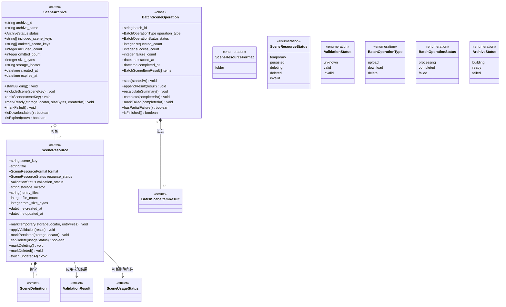

# 剧本管理类操作设计

> 状态：设计阶段。本文补充 `剧本管理数据模型.md` 中类模型的领域操作。类图中的函数表达领域对象自身的状态判断与状态迁移，不等同于 API 路由、文件系统函数或具体 Python 方法名。

## 1. 设计原则

- 类必须同时展示属性和领域操作；
- 结构体只承载数据，不定义具有副作用的业务函数；
- 枚举只定义有限值域；
- 文件读取、写入、删除和归档压缩由对应模块执行，类方法只在模块操作成功后维护领域状态；
- 类方法不得绕过剧本校验、删除保护或批量结果记录规则。

## 2. `SceneResource` 类操作

`SceneResource` 表示具有独立标识和生命周期的剧本资源。

| 函数 | 返回类型 | 职责 |
|---|---|---|
| `markTemporary(storageLocator, entryFiles)` | `void` | 记录临时存储定位信息和入口资源，并将资源状态设为 `temporary`。 |
| `applyValidation(result)` | `void` | 应用 `ValidationResult`，同步更新最近校验状态；校验失败时将资源标记为 `invalid`。 |
| `markPersisted(storageLocator)` | `void` | 在文件存储模块完成正式持久化后更新定位信息，并将状态设为 `persisted`。 |
| `canDelete(usageStatus)` | `boolean` | 根据 `SceneUsageStatus` 判断是否允许物理删除；存在运行占用时返回 `false`。 |
| `markDeleting()` | `void` | 在删除实际开始前将状态设为 `deleting`。 |
| `markDeleted()` | `void` | 在文件存储模块完成删除后将状态设为 `deleted`。 |
| `touch(updatedAt)` | `void` | 更新资源最近修改时间。 |

状态约束：

```text
temporary --校验通过并持久化--> persisted
    |                               |
    +--校验失败--> invalid          +--允许删除--> deleting --> deleted
```

## 3. `BatchSceneOperation` 类操作

`BatchSceneOperation` 表示一次批量上传、下载或删除任务。单个剧本失败不导致已经成功的项目回滚。

| 函数 | 返回类型 | 职责 |
|---|---|---|
| `start(startedAt)` | `void` | 将批量任务状态设为 `processing` 并记录开始时间。 |
| `appendResult(result)` | `void` | 按请求顺序加入一个 `BatchSceneItemResult`。 |
| `recalculateSummary()` | `void` | 根据项目结果重新计算请求数、成功数和失败数。 |
| `complete(completedAt)` | `void` | 完成全部项目处理，重新汇总数量，并将整体状态设为 `completed`。 |
| `markFailed(completedAt)` | `void` | 当批量请求本身无法开始或无法解析时将整体状态设为 `failed`。 |
| `hasPartialFailure()` | `boolean` | 判断是否同时存在成功项和失败项。 |
| `isFinished()` | `boolean` | 判断整体状态是否为 `completed` 或 `failed`。 |

`completed` 允许存在部分失败，其语义是“逐项处理已经结束”，不是“所有项目均成功”。

## 4. `SceneArchive` 类操作

`SceneArchive` 表示批量下载过程中产生的临时归档资源。

| 函数 | 返回类型 | 职责 |
|---|---|---|
| `startBuilding()` | `void` | 将归档状态设为 `building`。 |
| `includeScene(sceneKey)` | `void` | 将可读取的剧本加入归档清单，并更新包含数量。 |
| `omitScene(sceneKey)` | `void` | 记录未能加入归档的剧本，并更新省略数量。 |
| `markReady(storageLocator, sizeBytes, createdAt)` | `void` | 在文件归档模块完成构建后记录归档定位、大小和生成时间，并将状态设为 `ready`。 |
| `markFailed()` | `void` | 归档构建失败时将状态设为 `failed`。 |
| `isDownloadable()` | `boolean` | 仅当状态为 `ready` 且归档尚未过期时返回 `true`。 |
| `isExpired(now)` | `boolean` | 根据 `expiresAt` 判断临时归档是否已经过期。 |

## 5. 带函数的 Mermaid 类图



## 6. 实现约束

- `markPersisted` 不能代替文件持久化；只有文件存储模块成功写入正式存储后才能调用；
- `markDeleted` 不能代替物理删除；只有文件存储模块确认删除成功后才能调用；
- `canDelete` 必须消费仿真管理模块提供的占用结果，不得自行推测；
- `markReady` 不能代替归档构建；只有文件归档模块生成可读取归档后才能调用；
- 类操作名称允许在代码实现时按语言规范调整，但状态迁移、前置条件和失败语义必须保持一致。
