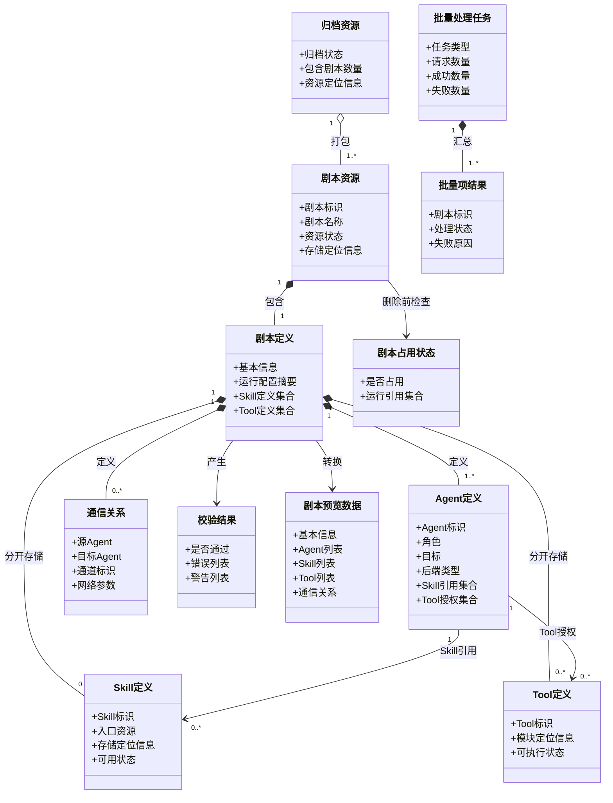
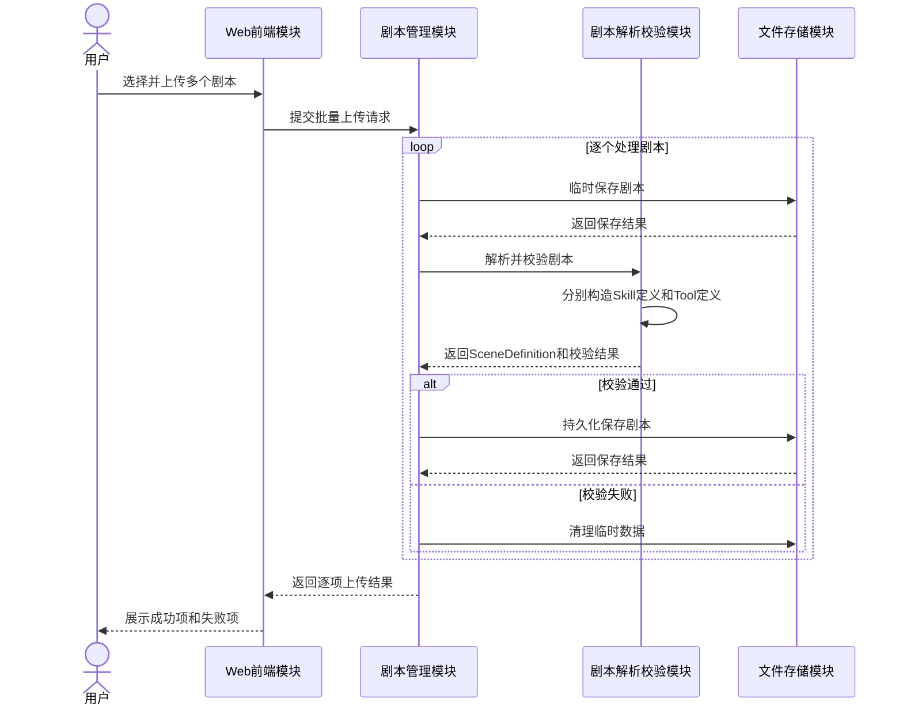
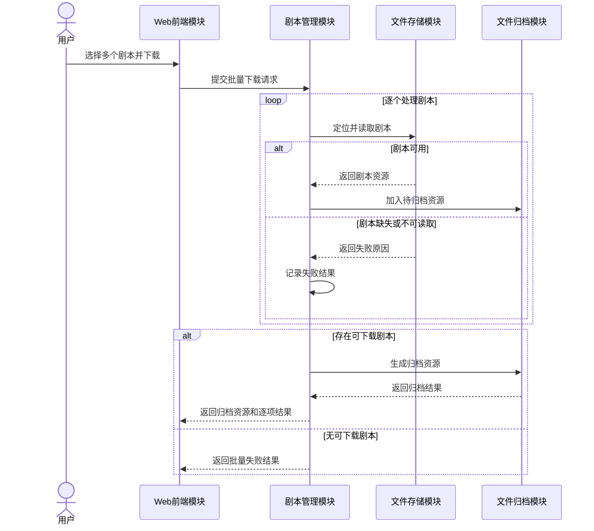
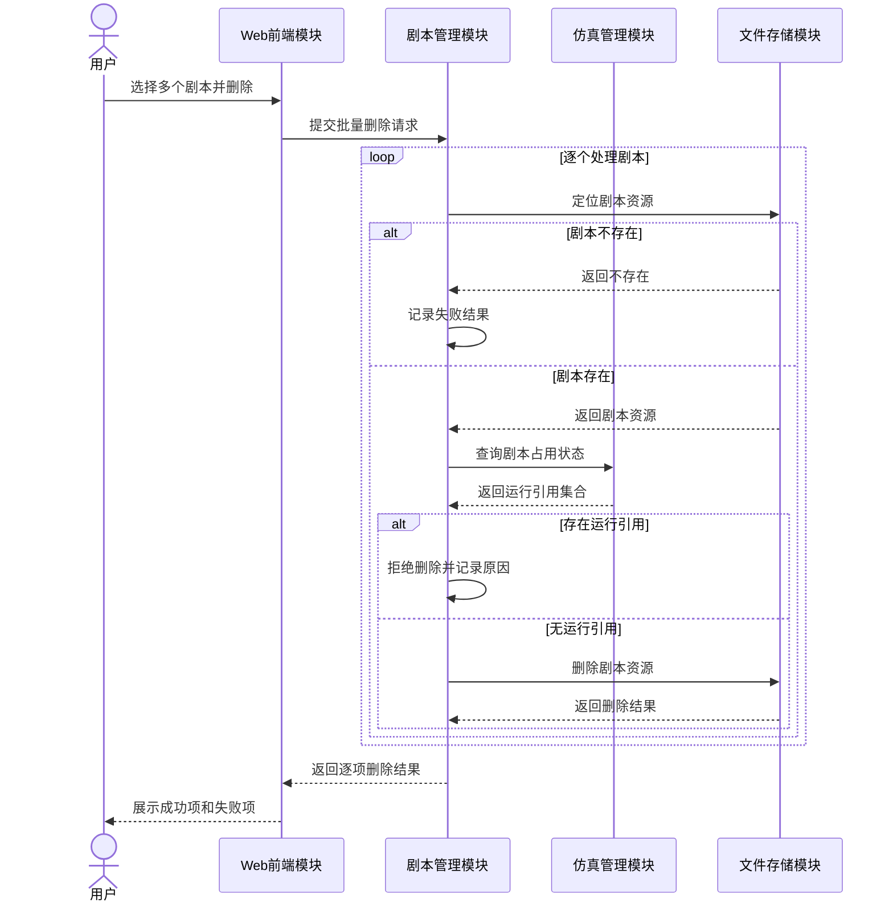
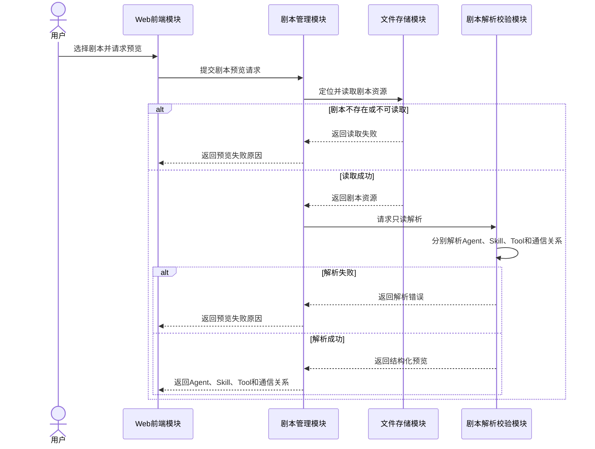
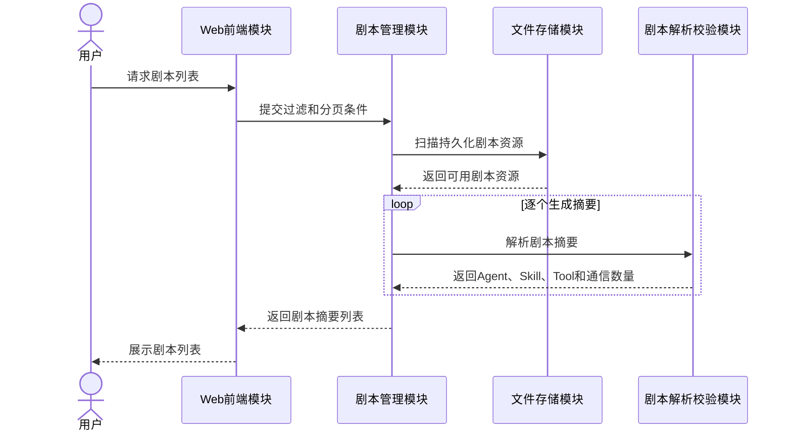

# 剧本管理设计

> 状态：设计阶段。本文记录剧本管理能力的需求边界、逻辑模块、接口、架构要求、数据模型和交互流程。当前代码已具备部分查询、读取和解析基础，其余能力按本文逐步实现。

## 1. 设计范围

剧本管理负责剧本资源进入平台后的完整管理流程，包括上传、查询、下载、删除和预览。

| SR-ID | SR名称 | SR描述 |
|---|---|---|
| SR-SCENE-01 | 剧本管理：上传剧本 | 平台支持批量上传剧本，对每个剧本进行临时保存、合法性校验、正式持久化和失败清理。 |
| SR-SCENE-02 | 剧本管理：下载剧本 | 平台支持批量下载剧本，将可读取剧本归档，并分别返回缺失或读取失败项。 |
| SR-SCENE-03 | 剧本管理：删除剧本 | 平台支持批量删除剧本，并在物理删除前检查运行占用状态。 |
| SR-SCENE-04 | 剧本管理：预览剧本 | 平台支持在不启动仿真的情况下生成单个剧本的结构化只读预览。 |
| SR-SCENE-05 | 剧本管理：查询剧本 | 平台支持查询已保存剧本并返回摘要列表，供下载、删除和预览时选择目标。 |

查询与预览边界：

- 查询返回多个剧本的摘要列表；
- 预览返回一个剧本的详细结构化信息；
- 查询不提供排序，只支持过滤和分页；
- 查询是独立能力，不作为其他 SR 的隐含附属步骤。

## 2. 当前代码基础与设计缺口

当前代码已具备：

- 从持久化剧本目录发现可用剧本；
- 按剧本标识读取剧本定义资源；
- 解析剧本基本信息、Agent 定义、Agent 的 Skill 引用、Tool 授权和通信拓扑；
- 保存当前剧本和仿真运行状态；
- Agent 运行期间按需读取 Skill 源资源并加载场景 Tool。

当前尚缺少完整的：

- 批量上传与逐项结果汇总；
- 临时存储、校验通过后持久化和失败清理；
- 批量下载与归档构建；
- 批量删除与部分失败结果；
- 独立、只读、结构化的预览流程；
- 在 `SceneDefinition` 中分别构造 Skill 定义集合与 Tool 定义集合；
- 面向剧本管理的统一模块边界和接口合同。

## 3. 逻辑模块

| 模块 | 主要职责 | 关联SR |
|---|---|---|
| Web前端模块 | 提交上传、查询、下载、删除和预览请求；展示列表、预览和处理结果 | SR-SCENE-01～05 |
| 剧本管理模块 | 统一编排剧本管理流程；维护批量任务上下文；汇总成功项和失败项 | SR-SCENE-01～05 |
| 文件存储模块 | 临时保存、持久化、定位、读取、删除和清理剧本资源 | SR-SCENE-01～05 |
| 剧本解析校验模块 | 校验剧本合法性；分别解析 Skill 与 Tool 定义；生成结构化剧本模型和预览数据 | SR-SCENE-01、04、05 |
| 文件归档模块 | 将多个可下载剧本组合成统一归档资源 | SR-SCENE-02 |
| 仿真管理模块 | 提供剧本运行占用状态，防止删除仍被运行时依赖的剧本资源 | SR-SCENE-03 |

设计约束：

- 剧本管理模块只负责编排，不直接实现文件解析、归档或仿真运行；
- 文件存储模块不理解剧本业务内容；
- 剧本解析和合法性校验归属同一逻辑模块，对外提供不同能力接口；
- Skill 源文件能力与 Tool 执行能力是不同资源类型，不得合并为统一能力定义；
- 当前不引入独立的剧本元数据模块或数据库索引；
- 后续出现版本、标签、创建人、审批状态或大规模搜索需求时，再评估元数据索引模块。

## 4. 模块接口

### 4.1 Web前端调用的业务接口

| 接口ID | 接口名称 | 提供模块 | 调用模块 | 关联SR | 主要输入 | 主要输出 |
|---|---|---|---|---|---|---|
| IF-SCENE-01 | 批量上传剧本 | 剧本管理模块 | Web前端模块 | SR-SCENE-01 | 多个剧本资源 | 各剧本上传结果和失败原因 |
| IF-SCENE-02 | 查询剧本列表 | 剧本管理模块 | Web前端模块 | SR-SCENE-05 | 查询条件 | 剧本摘要列表 |
| IF-SCENE-03 | 批量下载剧本 | 剧本管理模块 | Web前端模块 | SR-SCENE-02 | 多个剧本标识 | 归档资源和各剧本处理结果 |
| IF-SCENE-04 | 批量删除剧本 | 剧本管理模块 | Web前端模块 | SR-SCENE-03 | 多个剧本标识 | 各剧本删除结果 |
| IF-SCENE-05 | 预览剧本 | 剧本管理模块 | Web前端模块 | SR-SCENE-04 | 剧本标识 | 结构化预览数据或失败原因 |

### 4.2 剧本管理模块调用的内部接口

| 接口ID | 接口名称 | 提供模块 | 调用模块 | 关联SR | 主要职责 |
|---|---|---|---|---|---|
| IF-STORE-01 | 临时保存剧本 | 文件存储模块 | 剧本管理模块 | SR-SCENE-01 | 保存待校验的上传资源 |
| IF-STORE-02 | 持久化剧本 | 文件存储模块 | 剧本管理模块 | SR-SCENE-01 | 将校验通过的资源转入正式存储 |
| IF-STORE-03 | 定位剧本资源 | 文件存储模块 | 剧本管理模块 | SR-SCENE-02～05 | 根据剧本标识定位资源 |
| IF-STORE-04 | 读取剧本资源 | 文件存储模块 | 剧本管理模块、剧本解析校验模块 | SR-SCENE-02、04、05 | 读取剧本定义和关联资源 |
| IF-STORE-05 | 删除剧本资源 | 文件存储模块 | 剧本管理模块 | SR-SCENE-03 | 删除指定剧本的持久化资源 |
| IF-STORE-06 | 清理临时数据 | 文件存储模块 | 剧本管理模块 | SR-SCENE-01 | 清理校验失败或处理异常产生的临时数据 |
| IF-PARSER-01 | 校验剧本 | 剧本解析校验模块 | 剧本管理模块 | SR-SCENE-01 | 校验结构、Agent、Skill 引用、Tool 授权、通信关系和运行配置 |
| IF-PARSER-02 | 解析剧本 | 剧本解析校验模块 | 剧本管理模块 | SR-SCENE-04、05 | 生成包含独立 Skill/Tool 定义集合的剧本模型、预览或摘要 |
| IF-ARCHIVE-01 | 创建剧本归档 | 文件归档模块 | 剧本管理模块 | SR-SCENE-02 | 将多个可用剧本组合成一个归档资源 |
| IF-SIM-01 | 查询剧本占用状态 | 仿真管理模块 | 剧本管理模块 | SR-SCENE-03 | 返回依赖该剧本的仿真运行引用集合 |

所有接口应明确输入所有权、资源生命周期、失败语义、批量项结果和可观测事件。

## 5. 架构要求列表

| AR-ID | AR名称 | 关联的SR-ID | AR描述 |
|---|---|---|---|
| AR-COM-01 | 通用：批量文件操作 | SR-SCENE-01、02、03 | 系统应支持一次提交并分别处理多个剧本资源。 |
| AR-COM-03 | 通用：文件持久化 | SR-SCENE-01、02、04、05 | 系统应提供剧本资源的临时存储、持久化、定位和读取能力。 |
| AR-COM-04 | 通用：批量结果反馈 | SR-SCENE-01、02、03 | 系统应分别记录每个剧本的处理结果，并返回成功项、失败项及失败原因。 |
| AR-SCENE-01 | 剧本：合法性校验 | SR-SCENE-01 | 系统应校验上传剧本的结构、引用关系和运行配置，只有校验通过的剧本才能持久化。 |
| AR-SCENE-02 | 剧本：失败数据清理 | SR-SCENE-01 | 校验失败或处理异常时，系统应清理对应临时数据。 |
| AR-SCENE-03 | 剧本：归档下载 | SR-SCENE-02 | 系统应将批量下载中可用剧本打包为统一归档资源。 |
| AR-SCENE-04 | 剧本：资源删除 | SR-SCENE-03 | 系统应定位并删除用户指定的剧本持久化资源。 |
| AR-SCENE-05 | 剧本：删除保护 | SR-SCENE-03 | 删除前应查询运行占用，存在运行引用时不得物理删除。 |
| AR-SCENE-06 | 剧本：结构化解析 | SR-SCENE-04、05 | 系统应解析剧本基本信息、Agent、Skill 定义、Tool 定义、任务和通信关系。 |
| AR-SCENE-07 | 剧本：只读预览 | SR-SCENE-04 | 预览不得启动仿真、创建运行资源或改变当前仿真状态。 |
| AR-SCENE-08 | 剧本：预览异常反馈 | SR-SCENE-04 | 剧本不存在、不可读取或解析失败时，应返回明确原因。 |
| AR-SCENE-09 | 剧本：摘要查询 | SR-SCENE-05 | 系统应返回用于列表展示和目标选择的剧本摘要。 |
| AR-SCENE-10 | 剧本：Skill与Tool分离 | SR-SCENE-01、04、05 | `SceneDefinition` 应分别保存 Skill 定义集合和 Tool 定义集合，Agent 只保存对应引用。 |

## 6. 逻辑数据模型

该模型是逻辑模型，不代表必须新增数据库表。具体字段、类函数和枚举参见 `剧本管理数据模型.md` 与 `剧本管理类操作设计.md`。

## 7. 时序设计

### 7.1 批量上传剧本

### 7.2 批量下载剧本

### 7.3 批量删除剧本

当前并发仿真上限为 `1`，但占用接口返回运行引用集合；未来扩展多仿真时无需修改删除接口语义。

### 7.4 预览剧本

### 7.5 查询剧本

## 8. 批量结果与失败语义

批量上传、下载和删除统一返回：

- 请求项总数；
- 成功项数量；
- 失败项数量；
- 每个剧本的标识、处理状态、失败编码和失败原因；
- 下载时附带归档资源；
- 单个剧本失败不回滚已经成功的其他剧本。

## 9. 观测要求

剧本管理操作写入 `application.jsonl`，至少记录：

- 批量任务标识和操作类型；
- 剧本标识；
- 操作开始、完成或失败状态；
- 校验错误、归档错误、占用拒绝和存储错误；
- 处理数量和耗时。

剧本文件管理本身不产生 `network.jsonl` 记录；只有真实抓包得到的网络层和传输层数据进入 `network.jsonl`。

## 10. 推荐实现顺序

1. 实现只读解析器，构造独立 `skills` 和 `tools` 定义集合；
2. 实现剧本查询与只读预览；
3. 实现上传临时保存、校验、持久化和失败清理；
4. 实现批量删除和占用保护；
5. 实现批量下载和归档生命周期；
6. 增加测试，确保 Agent 的 Skill 引用与 Tool 授权分别校验。