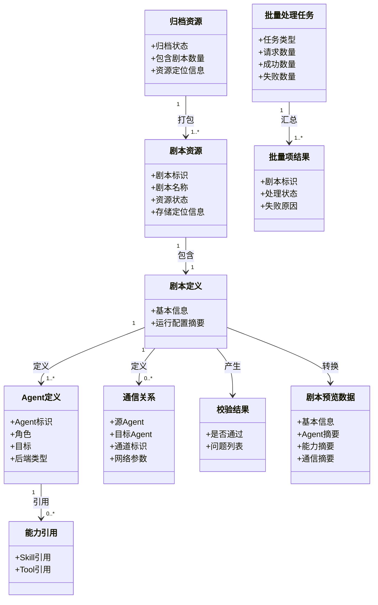
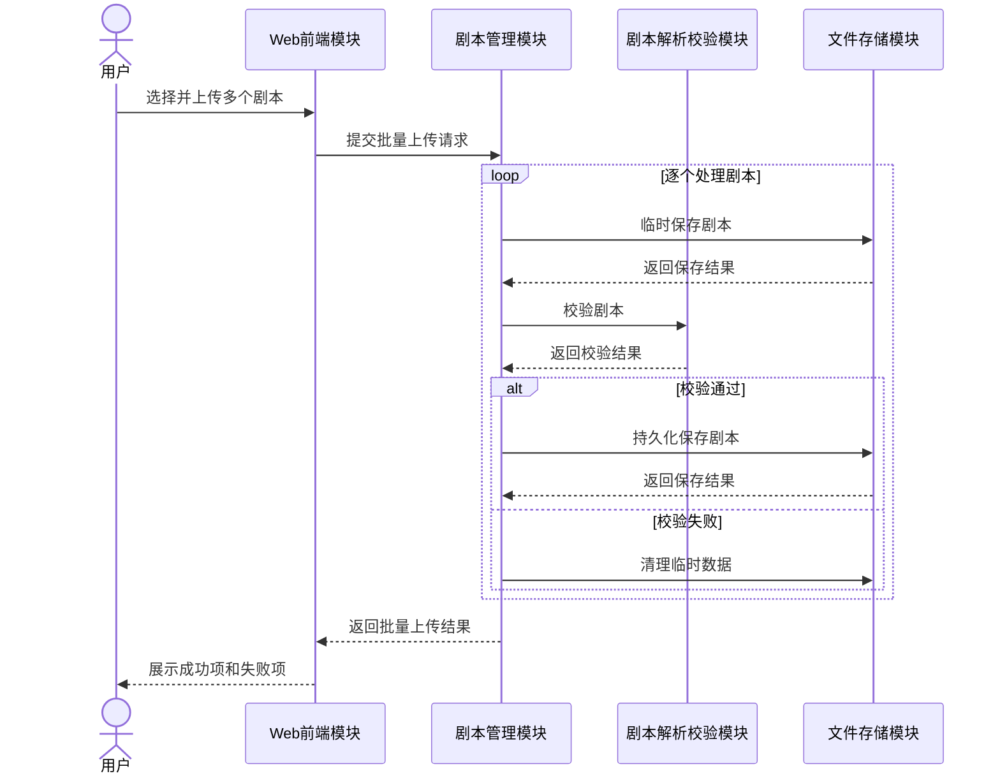
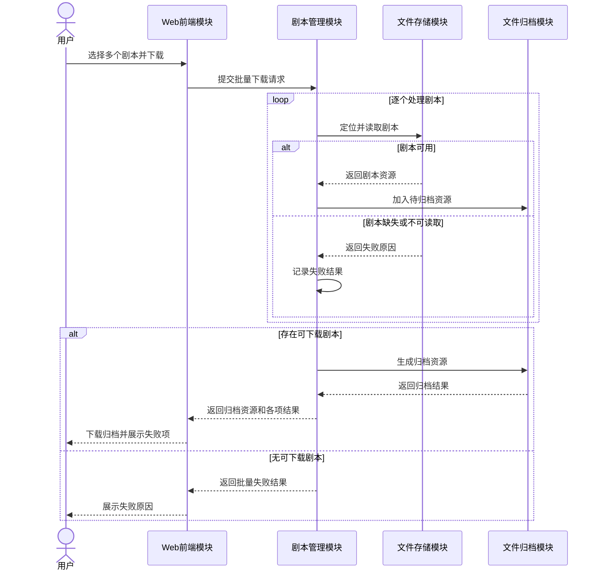
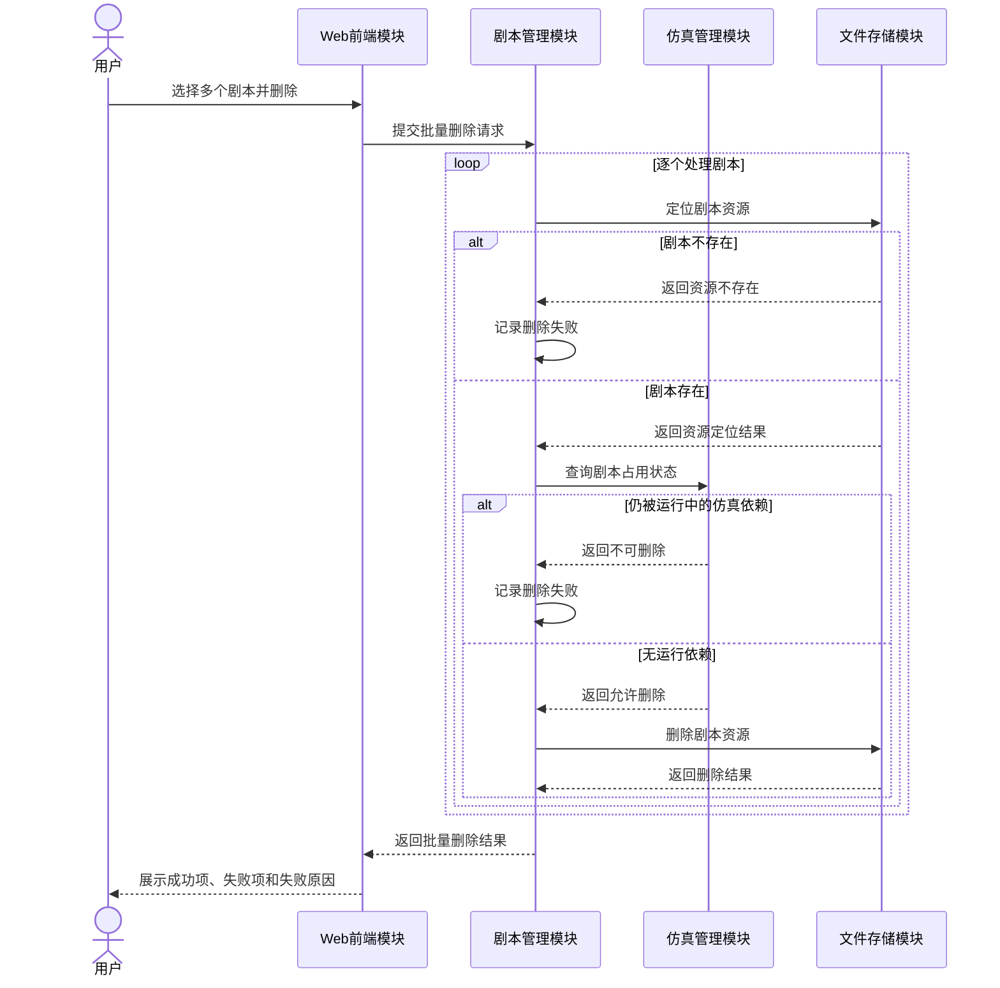
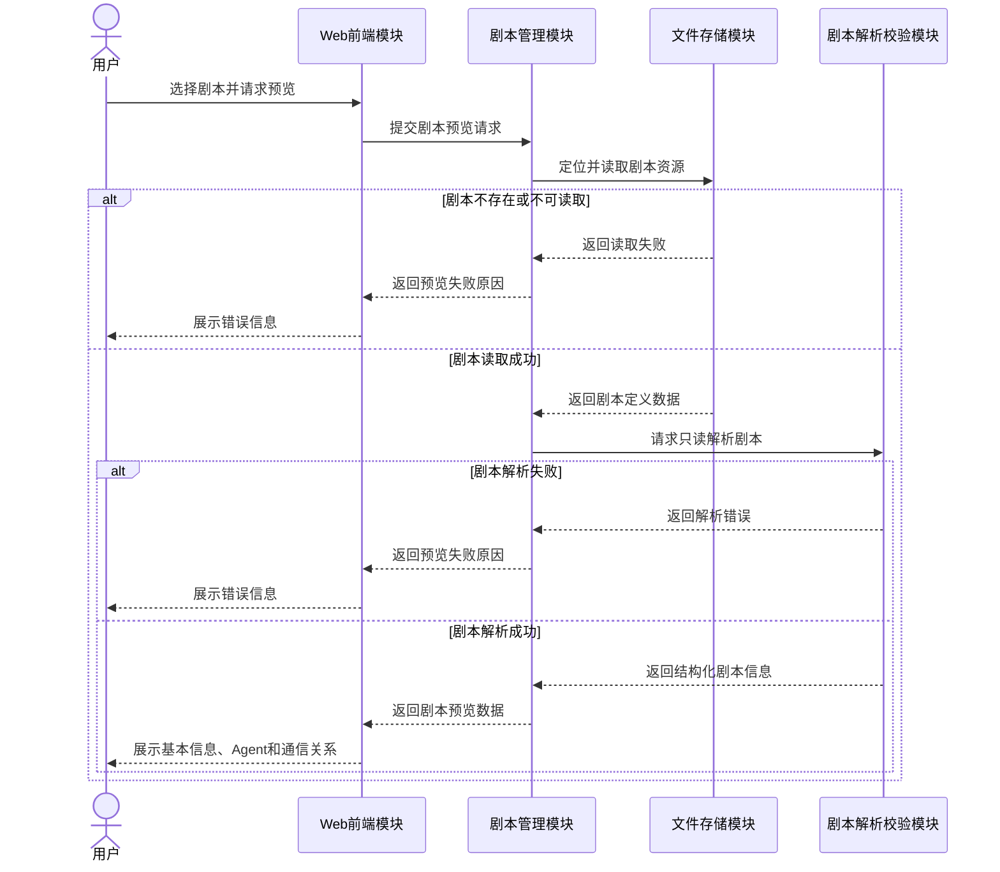
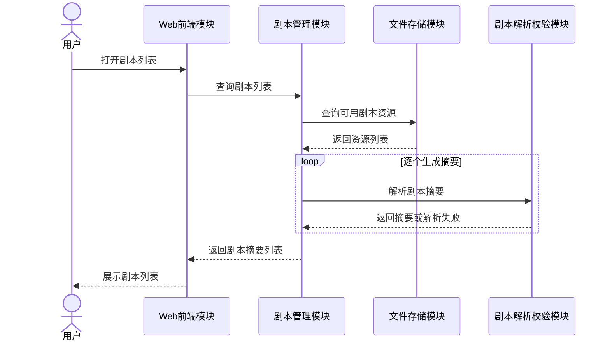

# 剧本管理设计

> 状态：设计阶段。本文记录剧本管理能力的需求边界、逻辑模块、接口、架构要求、数据模型和交互流程。当前代码已具备部分查询、读取和解析基础，其余能力按本文逐步实现。

## 1. 设计范围

剧本管理负责剧本资源进入平台后的完整管理流程，包括上传、查询、下载、删除和预览。

| SR-ID | SR名称 | SR描述 |
|---|---|---|
| SR-SCENE-01 | 剧本管理：上传剧本 | “批量上传”要求批量处理；上传文件需要持久化存储；上传时或上传后需要进行合法性校验。 |
| SR-SCENE-02 | 剧本管理：下载剧本 | “批量下载”要求批量处理；多个文件需要归档打包；部分文件缺失时应返回独立结果。 |
| SR-SCENE-03 | 剧本管理：删除剧本 | “批量删除”需要批量处理、资源定位和部分失败处理。 |
| SR-SCENE-04 | 剧本管理：预览剧本 | “预览剧本信息”要求系统解析剧本并生成结构化预览数据。 |
| SR-SCENE-05 | 剧本管理：查询剧本 | 系统应查询已保存的剧本并返回摘要列表，供下载、删除和预览时选择目标剧本。 |

查询剧本与预览剧本的边界：

- 查询剧本返回多个剧本的摘要列表；
- 预览剧本返回一个剧本的详细结构化信息；
- 查询是独立能力，不作为上传、下载、删除或预览的隐含附属步骤。

## 2. 当前代码基础与设计缺口

当前代码已具备：

- 从持久化剧本存储中发现可用剧本；
- 按剧本标识读取剧本定义数据；
- 将剧本基本信息、Agent 定义、Skill 引用和通信拓扑解析为内存对象；
- 保存当前剧本和仿真运行状态；
- 在 Agent 运行期间按需读取剧本中的 Skill 和场景 Tool 资源。

当前尚缺少完整的：

- 批量上传与上传结果汇总；
- 临时存储、校验通过后持久化和失败清理；
- 批量下载与归档打包；
- 批量删除与部分失败结果；
- 独立、只读、结构化的预览流程；
- 面向剧本管理的统一模块边界和接口合同。

## 3. 逻辑模块

| 模块 | 主要职责 | 关联SR |
|---|---|---|
| Web前端模块 | 提交上传、查询、下载、删除和预览请求；展示列表、预览和处理结果 | SR-SCENE-01～05 |
| 剧本管理模块 | 统一编排剧本管理流程；维护批量任务上下文；汇总成功项和失败项 | SR-SCENE-01～05 |
| 文件存储模块 | 临时保存、持久化、定位、读取、删除和清理剧本资源 | SR-SCENE-01～05 |
| 剧本解析校验模块 | 校验剧本合法性；将剧本定义转换为结构化领域模型和预览数据 | SR-SCENE-01、04 |
| 文件归档模块 | 将多个可下载剧本组合成统一归档资源 | SR-SCENE-02 |
| 仿真管理模块 | 提供剧本运行占用状态，防止删除仍被运行时依赖的剧本资源 | SR-SCENE-03 |

设计约束：

- 剧本管理模块只负责编排，不直接实现文件解析、归档或仿真运行；
- 文件存储模块不理解剧本业务内容；
- 剧本解析和合法性校验在逻辑架构上归属同一模块，对外提供不同能力接口；
- 当前不引入独立的“剧本元数据模块”或数据库索引，剧本摘要可以从持久化资源和解析结果获得；
- 后续出现版本、标签、创建人、审批状态、大规模分页搜索或对象存储需求时，再单独评估元数据索引模块。

## 4. 模块接口

### 4.1 Web前端调用的业务接口

| 接口ID | 接口名称 | 提供模块 | 调用模块 | 关联SR | 主要输入 | 主要输出 |
|---|---|---|---|---|---|---|
| IF-SCENE-01 | 批量上传剧本 | 剧本管理模块 | Web前端模块 | SR-SCENE-01 | 多个剧本资源 | 各剧本上传结果和失败原因 |
| IF-SCENE-02 | 查询剧本列表 | 剧本管理模块 | Web前端模块 | SR-SCENE-05 | 查询条件 | 剧本摘要列表 |
| IF-SCENE-03 | 批量下载剧本 | 剧本管理模块 | Web前端模块 | SR-SCENE-02 | 多个剧本标识 | 归档资源和各剧本处理结果 |
| IF-SCENE-04 | 批量删除剧本 | 剧本管理模块 | Web前端模块 | SR-SCENE-03 | 多个剧本标识 | 各剧本删除结果 |
| IF-SCENE-05 | 预览剧本 | 剧本管理模块 | Web前端模块 | SR-SCENE-04 | 剧本标识 | 结构化预览数据或失败原因 |

### 4.2 剧本管理模块调用的内部接口

| 接口ID | 接口名称 | 提供模块 | 调用模块 | 关联SR | 主要职责 |
|---|---|---|---|---|---|
| IF-STORE-01 | 临时保存剧本 | 文件存储模块 | 剧本管理模块 | SR-SCENE-01 | 保存待校验的上传资源 |
| IF-STORE-02 | 持久化剧本 | 文件存储模块 | 剧本管理模块 | SR-SCENE-01 | 将校验通过的资源转入正式存储 |
| IF-STORE-03 | 定位剧本资源 | 文件存储模块 | 剧本管理模块 | SR-SCENE-02～05 | 根据剧本标识定位资源 |
| IF-STORE-04 | 读取剧本资源 | 文件存储模块 | 剧本管理模块、剧本解析校验模块 | SR-SCENE-02、04、05 | 读取剧本定义和关联资源 |
| IF-STORE-05 | 删除剧本资源 | 文件存储模块 | 剧本管理模块 | SR-SCENE-03 | 删除指定剧本的持久化资源 |
| IF-STORE-06 | 清理临时数据 | 文件存储模块 | 剧本管理模块 | SR-SCENE-01 | 清理校验失败或处理异常产生的临时数据 |
| IF-PARSER-01 | 校验剧本 | 剧本解析校验模块 | 剧本管理模块 | SR-SCENE-01 | 校验结构、Agent、Skill/Tool 引用、通信关系和运行配置 |
| IF-PARSER-02 | 解析剧本 | 剧本解析校验模块 | 剧本管理模块 | SR-SCENE-04、05 | 生成结构化剧本模型、预览数据或摘要数据 |
| IF-ARCHIVE-01 | 创建剧本归档 | 文件归档模块 | 剧本管理模块 | SR-SCENE-02 | 将多个可用剧本组合成一个归档资源 |
| IF-SIM-01 | 查询剧本占用状态 | 仿真管理模块 | 剧本管理模块 | SR-SCENE-03 | 判断剧本是否仍被运行中的仿真依赖 |

所有接口应明确：输入所有权、资源生命周期、失败语义、批量项结果和可观测事件。

## 5. 架构要求列表

| AR-ID | AR名称 | 关联的SR-ID | AR描述 |
|---|---|---|---|
| AR-COM-01 | 通用：批量文件操作 | SR-SCENE-01、SR-SCENE-02、SR-SCENE-03 | 系统应支持一次提交并分别处理多个剧本资源。 |
| AR-COM-03 | 通用：文件持久化 | SR-SCENE-01、SR-SCENE-02、SR-SCENE-04、SR-SCENE-05 | 系统应提供剧本资源的临时存储、持久化、定位和读取能力。 |
| AR-COM-04 | 通用：批量结果反馈 | SR-SCENE-01、SR-SCENE-02、SR-SCENE-03 | 系统应分别记录每个剧本的处理结果，并返回成功项、失败项及失败原因。 |
| AR-SCENE-01 | 剧本：合法性校验 | SR-SCENE-01 | 系统应校验上传剧本的结构、引用关系和运行配置，只有校验通过的剧本才能进入持久化存储。 |
| AR-SCENE-02 | 剧本：失败数据清理 | SR-SCENE-01 | 剧本校验失败或处理异常时，系统应清理对应临时数据，避免产生无效或残留资源。 |
| AR-SCENE-03 | 剧本：归档下载 | SR-SCENE-02 | 系统应将批量下载中可用的剧本资源打包为统一归档资源。 |
| AR-SCENE-04 | 剧本：资源删除 | SR-SCENE-03 | 系统应定位并删除用户指定的剧本持久化资源。 |
| AR-SCENE-05 | 剧本：删除保护 | SR-SCENE-03 | 系统应在删除剧本前检查剧本是否仍被运行中的仿真依赖，存在运行依赖时不得物理删除。 |
| AR-SCENE-06 | 剧本：结构化解析 | SR-SCENE-04、SR-SCENE-05 | 系统应将剧本定义解析为结构化剧本信息，包括基本信息、Agent、能力配置、任务和通信关系。 |
| AR-SCENE-07 | 剧本：只读预览 | SR-SCENE-04 | 系统应在不启动仿真、不创建运行资源且不改变当前仿真状态的情况下生成剧本预览数据。 |
| AR-SCENE-08 | 剧本：预览异常反馈 | SR-SCENE-04 | 剧本不存在、不可读取或解析失败时，系统应返回明确的预览失败原因。 |
| AR-SCENE-09 | 剧本：摘要查询 | SR-SCENE-05 | 系统应查询所有可用剧本并返回用于列表展示和目标选择的摘要信息。 |

## 6. 逻辑数据模型

该模型是逻辑模型，不代表必须新增数据库表。当前阶段允许以持久化资源扫描和按需解析实现。

## 7. 时序设计

### 7.1 批量上传剧本

### 7.2 批量下载剧本

### 7.3 批量删除剧本

### 7.4 预览剧本

### 7.5 查询剧本列表

## 8. 删除策略与运行依赖

剧本的基础结构在仿真准备阶段会加载到内存，但当前运行时仍会按需访问剧本持久化资源，包括：

- Agent 使用 Skill 时读取 Skill 源文件；
- 场景 Tool 在运行环境中动态加载；
- 运行后端通过剧本标识定位允许访问的资源。

因此，“剧本结构已加载到内存”不等于“全部运行依赖已脱离持久化资源”。当前架构下必须在物理删除前查询剧本占用状态。

当前决定：

- 正在被仿真使用的剧本不得物理删除；
- 不采用“删除后依靠内存继续运行”的不完整保证；
- 若未来实现完整的仿真运行快照，包含 Agent 定义、Skill、Tool 和其他运行资源，并保证运行过程只访问快照，则可以重新评估删除保护；
- 在快照机制实现前，不得移除占用状态检查。

## 9. 失败语义

### 9.1 批量操作

批量上传、下载和删除采用“逐项独立处理、整体汇总”的语义：

- 一个剧本失败不得自动回滚其他已经成功的剧本；
- 返回请求总数、成功数量、失败数量和逐项明细；
- 每个失败项必须包含稳定的失败类型和可读原因；
- 系统级异常导致无法继续处理时，应保留已完成项结果并标明任务中断。

### 9.2 上传

- 临时保存失败：该项失败，不进入校验；
- 校验失败：该项失败并清理临时资源；
- 持久化失败：该项失败并清理不完整资源；
- 重名或资源冲突：必须返回明确冲突结果，不静默覆盖。

### 9.3 下载

- 部分剧本缺失：其余可用剧本仍生成归档；
- 所有剧本均不可用：不生成空归档，只返回失败结果；
- 归档生成失败：返回归档级失败，并保留逐项资源读取结果。

### 9.4 删除

- 剧本不存在：该项失败；
- 剧本仍被运行依赖：该项失败；
- 删除存储失败：该项失败，不影响其他项；
- 删除成功后，查询列表不得继续返回该剧本。

### 9.5 预览与查询

- 预览必须只读，不改变当前仿真状态；
- 无法解析的剧本可在查询列表中标记为异常，但不得导致整个列表查询失败；
- 预览失败应区分资源不存在、读取失败和解析失败。

## 10. 观测要求

剧本管理操作应记录在应用层日志中，至少包含：

- 操作类型；
- 请求或批量任务标识；
- 剧本标识；
- 操作状态；
- 失败类型和失败原因；
- 处理耗时；
- 批量任务的成功数和失败数。

这些记录属于 Agent 行为和传统应用层日志范围，不得写入网络数据日志。真实网络数据仍只来自抓包证据。

## 11. 后续实现顺序

建议按以下顺序实现：

1. 抽取无副作用的剧本解析校验模块；
2. 明确文件存储模块的临时、持久化、定位、读取、删除和清理合同；
3. 将现有剧本列表和读取能力纳入剧本管理模块；
4. 实现只读预览和独立查询 SR；
5. 实现批量上传；
6. 实现批量下载和归档；
7. 实现带运行占用检查的批量删除；
8. 补充测试、应用日志和 Dashboard 交互。
